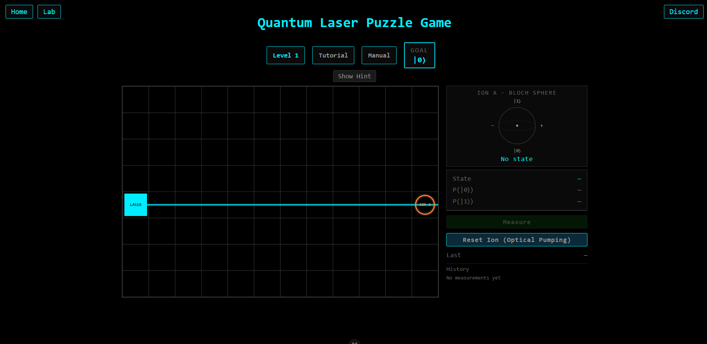
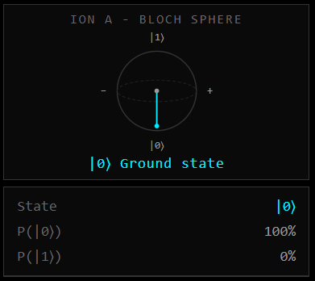
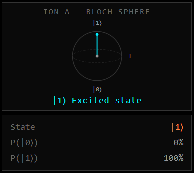
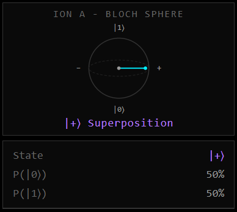
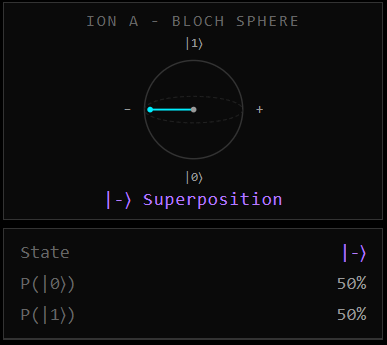
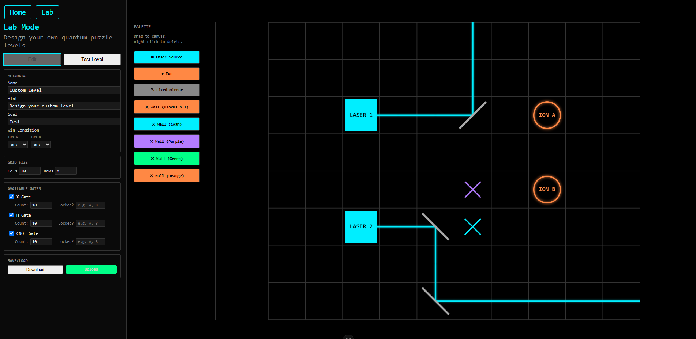
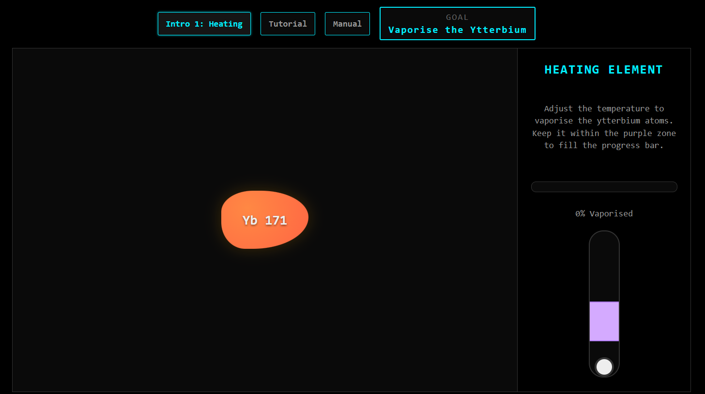
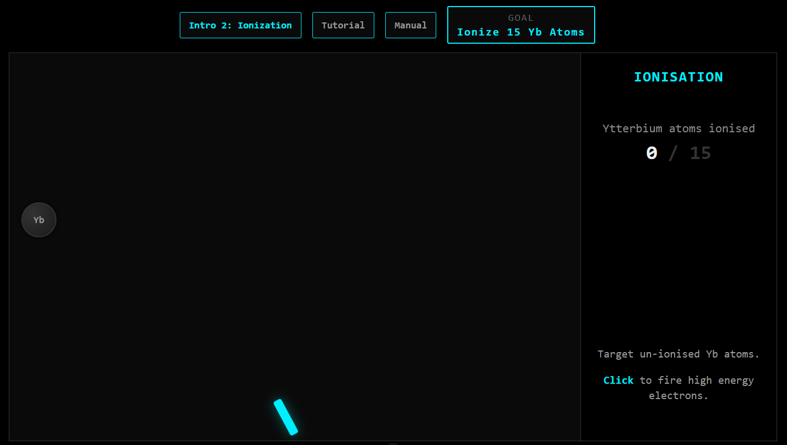
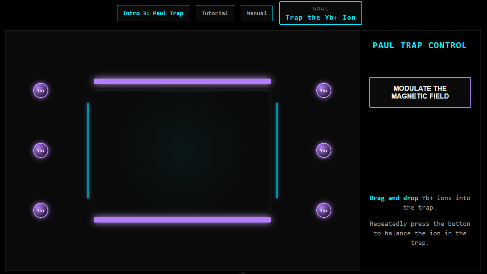
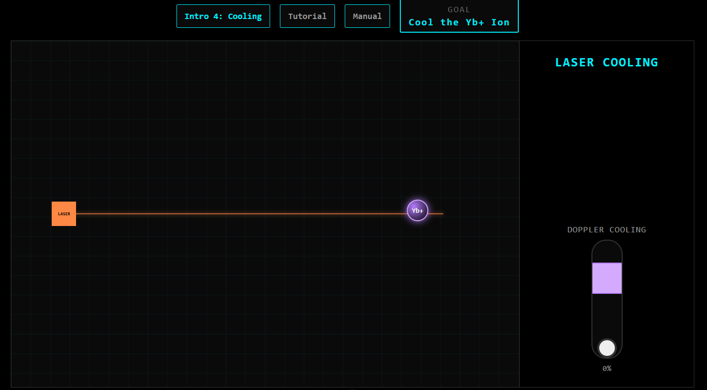

# Quantum Laser Puzzle: A Serious Game About Quantum Gates & Trapped-Ion Computing - [Play Here](https://quantum-educational-game.vercel.app/)
 


> A browser-based educational puzzle game that teaches quantum gate logic (Pauli-X, Hadamard, CNOT) through the lens of trapped-ion quantum computing. Route a laser through mirrors and quantum gates, watch the Bloch sphere respond in real time and discover superposition, phase and entanglement through play rather than dense mathematical text.

Developed as a Computer Science (Conversion) MSc project at the [University of Sussex](https://www.sussex.ac.uk/), supervised by Dr. Giulio Guerrieri, Informatics Department.

---

## Table of Contents

- [Overview](#overview)
- [Features](#features)
- [Screenshots](#screenshots)
- [Curriculum](#curriculum)
- [Tech Stack](#tech-stack)
- [Architecture](#architecture)
- [Getting Started](#getting-started)
- [Testing](#testing)
- [Lab Mode](#lab-mode)
- [Limitations & Design Tradeoffs](#limitations--design-tradeoffs)
- [Future Scope](#future-scope)
- [References](#references)
- [Acknowledgements](#acknowledgements)

---

## Overview

Quantum computing is one of the most significant emerging fields in computer science, but its foundational principles (superposition, phase and entanglement) are notoriously difficult to grasp. They're mathematically abstract, rarely taught before university and most existing educational tools either bury the concepts in dense notation or gamify them so loosely that the underlying physics gets lost.

This project grounds quantum logic in a specific physical architecture, trapped-ion quantum computing and teaches it through a Socratic, discovery-driven puzzle format. Instead of reading about superposition, players create it by firing a laser through a Hadamard gate and watching the Bloch sphere move.

All quantum mechanics are computed entirely client-side via a custom TypeScript state-vector engine, with no backend, no network latency and no Qiskit dependency.

## Features

- **Physically-grounded introduction**: heat, ionise, trap and laser-cool a Ytterbium-171 ion to understand the physical process behind preparing an ion for computation.
- **Laser-routing puzzle mechanic**: place and rotate mirrors to guide a laser through quantum gates and into an ion.
- **Real-time Bloch sphere visualisation**: every ion's state and phase updates live, before measurement collapses it.
- **Automated measurement simulator**: repeated measurement loops visually prove statistical (Born Rule) distributions.
- **20-level progressive curriculum**: from single-qubit basics to Bell pairs and multi-qubit GHZ states.
- **Lab Mode**: a sandbox circuit editor with custom win conditions and JSON import/export.
- **Fully unit-tested quantum engine**: Vitest-backed math, gate logic and level validation, enforced via CI.

## Screenshots
 
**Bloch Sphere States**
 
| $\lvert 0\rangle$ | $\lvert 1\rangle$ | $\lvert +\rangle$ | $\lvert -\rangle$ |
|---|---|---|---|
|  |  |  |  |
 
**Lab Mode**
 


## Curriculum

The curriculum follows an incremental framework, introducing each concept in isolation before combining them into more complex puzzles.

### Introduction Stage: Ion Preparation
Four minigames modelled on the ion-trapping process used at the University of Sussex:
1. **Heating Ytterbium**: keep a thermal dial within an oscillating optimal zone

2. **Ionisation**: time projectile pulses to strip electrons and produce Yb+ ions

3. **The Paul Trap**: modulate electromagnetic fields to confine the ion

4. **Laser Cooling**: Doppler and sideband cooling to reach a stable ground state


### Phase 1: Single-Qubit Operations *(Levels 1-9)*
State initialisation, laser routing, the **Pauli-X** and **Hadamard** gates and an introduction to hidden phase via a negative superposition puzzle.

### Phase 2: Two-Qubit Interactions *(Levels 10-15)*
The **CNOT** gate, Bell state construction, anti-correlation and gate-order/"uncomputing" puzzles.

### Phase 3: Multi-Qubit Systems *(Levels 16-20)*
Cascading CNOT gates to build **GHZ states** across 3-4 qubits, culminating in a level requiring two *independent* Bell pairs on the same grid, demonstrating that entanglement is a localised, not universal, property.

## Tech Stack

| Layer | Choice | Reasoning |
|---|---|---|
| Framework | [Vue 3](https://vuejs.org/) | Reactive data-binding keeps the Bloch sphere & UI in sync with quantum state |
| Language | [TypeScript](https://www.typescriptlang.org/) | Strict typing across a mathematically complex codebase |
| Build tool | [Vite](https://vitejs.dev/) | Fast dev server, HMR, optimised Rollup bundles |
| Routing | Vue Router | Frictionless navigation between main game and Lab Mode |
| Testing | [Vitest](https://vitest.dev/) | Unit tests for the math engine, gate logic and level validation |
| Hosting/CI-CD | [Vercel](https://vercel.com/) + GitHub Actions | Auto preview deploys per PR, branch-protected `main` |
| Linting | ESLint + Prettier | Consistent style across the codebase |

## Quantum Mathematical Engine

The quantum engine represents an *n*-qubit system as a single state vector of 2^n complex amplitudes, manipulated via bitwise masking rather than matrix multiplication. This technique is inspired by [Haner & Steiger's 45-qubit simulation](https://doi.org/10.48550/ARXIV.1704.01127) and production simulators like [QuEST](https://doi.org/10.48550/ARXIV.1802.08032). The engine supports up to 6 qubits, comfortably covering the curriculum while remaining fast in-browser.

## Key Equations
 
The mathematical engine implements the following core quantum mechanics.
 
**Qubit state.** A single qubit is a linear combination of the two basis states $|0\rangle$ and $|1\rangle$, with complex amplitudes $\alpha$ and $\beta$:
 
$$|\psi\rangle = \alpha|0\rangle + \beta|1\rangle, \qquad |\alpha|^2 + |\beta|^2 = 1$$
 
**Born rule.** The probability of measuring a given basis state is the squared modulus of its amplitude:
 
$$P(x) = |\langle x|\psi\rangle|^2$$
 
**Pauli-X gate.** A deterministic bit-flip, implemented as an index swap rather than complex arithmetic:
 
$$X = \begin{pmatrix} 0 & 1 \\ 1 & 0 \end{pmatrix}, \qquad X|0\rangle = |1\rangle, \quad X|1\rangle = |0\rangle$$
 
**Hadamard gate.** Creates an equal superposition, encoding relative phase in the sign of the amplitude:
 
$$H = \frac{1}{\sqrt{2}}\begin{pmatrix} 1 & 1 \\ 1 & -1 \end{pmatrix}$$
 
$$H|0\rangle = \frac{|0\rangle + |1\rangle}{\sqrt{2}}, \qquad H|1\rangle = \frac{|0\rangle - |1\rangle}{\sqrt{2}}$$
 
**CNOT gate.** A two-qubit conditional flip that produces entanglement when the control qubit is in superposition:
 
$$\text{CNOT} = \begin{pmatrix} 1 & 0 & 0 & 0 \\ 0 & 1 & 0 & 0 \\ 0 & 0 & 0 & 1 \\ 0 & 0 & 1 & 0 \end{pmatrix}$$
 
**Marginal probability.** For an entangled multi-qubit system, the probability of a single qubit $q$ reading 0 or 1 is found by summing over every basis-state index $i$ whose $q$-th bit matches:
 
$$P(q=b) = \sum_{i \,:\, \text{bit}_q(i) = b} |\alpha_i|^2$$

## Getting Started

```bash
# Clone the repository
git clone https://github.com/<your-username>/<repo-name>.git
cd <repo-name>

# Install dependencies
npm install

# Run the dev server
npm run dev

# Build for production
npm run build
```

No backend, database, or login is required. Progress is stored locally via browser cache.

## Testing

The quantum engine, gate logic, level configuration and Lab Mode components are covered by an automated [Vitest](https://vitest.dev/) suite, run on every pull request via GitHub Actions.

```bash
npm run test
```

## Limitations & Design Tradeoffs

This is a deliberately **idealised** model of trapped-ion computing, designed to keep puzzles solvable and deterministic:

- No environmental noise, decoherence, or readout error is simulated (real systems are in the [NISQ era](https://doi.org/10.48550/ARXIV.1801.00862)).
- Real-time Bloch sphere visibility is a pedagogical convenience; in reality this requires [quantum state tomography](https://doi.org/10.48550/ARXIV.0809.4368) across thousands of runs.
- The CNOT gate abstracts away the [Molmer-Sorensen](https://doi.org/10.48550/ARXIV.QUANT-PH/9810040) mechanism (shared motional coupling, collisional phase errors) into an instantaneous, freely-routable action.
- Gates are discrete, instantaneous operations rather than points on a continuously variable rotation.

These simplifications are intentional. They keep the focus on the*logical structure of quantum operations rather than the engineering challenges of real hardware.

## References

Key sources underpinning the pedagogical and technical design. See the full dissertation for the complete reference list:

- Nielsen, M. A., & Chuang, I. L. (2000). *Quantum Computation and Quantum Information.* Cambridge University Press.
- Cirac, J. I., & Zoller, P. (1995). Quantum Computations with Cold Trapped Ions. *Physical Review Letters, 74*(20).
- Leibfried, D., Blatt, R., Monroe, C., & Wineland, D. (2003). Quantum dynamics of single trapped ions. *Reviews of Modern Physics, 75*(1).
- Haner, T., & Steiger, D. S. (2017). [0.5 Petabyte Simulation of a 45-Qubit Quantum Circuit](https://doi.org/10.48550/ARXIV.1704.01127).
- Jones, T., Brown, A., Bush, I., & Benjamin, S. (2018). [QuEST and High Performance Simulation of Quantum Computers](https://doi.org/10.48550/ARXIV.1802.08032).
- Lekitsch, B. et al. (2015). [Blueprint for a microwave trapped-ion quantum computer](https://doi.org/10.48550/ARXIV.1508.00420).

## Acknowledgements

- **Dr. Giulio Guerrieri**: Project Supervisor, Informatics Department, University of Sussex
- **Gareth Hopkins**: Quantum Information PhD contributor
- All participants who playtested the game and shaped its final design

---

*Submitted as part requirement for the degree of Computer Science (Conversion) at the University of Sussex, August 2026. Freely copyable and distributable provided the source is acknowledged.*
